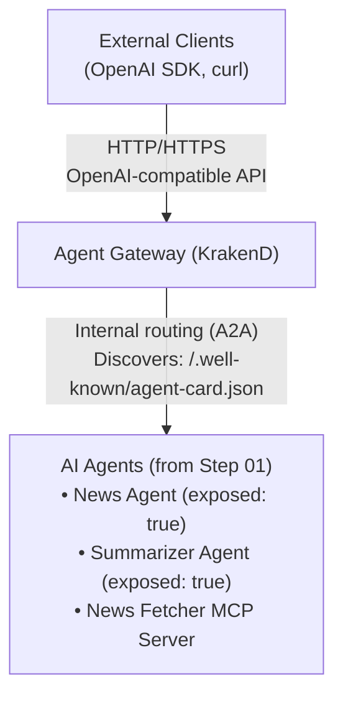

# Step 02: Agent Gateway

## What You'll Learn

In this step, you will:
- Understand the idea of an Agent Gateway
- Deploy the Agent Gateway KrakenD Operator

## What You'll Build

By the end of this step, you will have deployed:
- **Agent Gateway KrakenD Operator**: Manages Agent Gateways 
- **AgentGateway Resource**: A gateway instance that routes to your agents
- **Exposed Agents**: Agents configured to be accessible via the gateway
- **Frontend Access**: Web UI for interacting with agents

## Prerequisites

Before starting this step, ensure you have:
- Completed Step 01 (Agent Runtime Operator and agents deployed)
- Agents running in the `showcase-news` namespace
- kubectl access to your vcluster

Verify your agents are running:
```bash
kubectl get agents -n showcase-news
```

---

## Understanding the Building Blocks

### What is the Agent Gateway?

The Agent Gateway is an API gateway that provides a unified entry point for accessing AI agents deployed on Kubernetes. It solves several key challenges:

**Without Agent Gateway** (Step 01):
- Agents are only accessible via port-forwarding
- Each agent has its own endpoint (localhost:8001, localhost:8002, etc.)
- No unified interface for client applications
- Direct service access only

**With Agent Gateway** (Step 02):
- Single entry point for all agents
- Automatic agent discovery and routing
- Support for both A2A and OpenAI protocols
- Simplified client access through unified endpoint
- Foundation for adding ingress, auth, and rate limiting layers

### Key Concepts

- **AgentGateway CRD**: Defines a gateway instance that routes traffic to agents (configurable: replicas, timeout)
- **AgentGatewayClass**: Cluster-wide resource that specifies which operator implementation to use (e.g., KrakenD)
- **KrakenD**: High-performance API gateway used as the underlying reverse proxy
- **Service Discovery**: Gateway automatically discovers agents with `exposed: true` and creates routing endpoints
- **Protocol Support**: Agents using A2A protocol get agent card endpoints at `/.well-known/agent-card.json`
- **Selective Exposure**: Only agents with `spec.exposed: true` are routed through the gateway


### Architecture




---

## Installation Steps

### Step 1: Install Agent Gateway KrakenD Operator

The Agent Gateway KrakenD Operator implements the AgentGateway CRD using KrakenD as the underlying API gateway.

Install the operator:
```bash
kubectl apply -f https://github.com/agentic-layer/agent-gateway-krakend-operator/releases/download/v0.1.4/install.yaml
```

Wait for the operator to be ready:
```bash
kubectl wait --for=condition=Available --timeout=60s -n agent-gateway-krakend-operator-system deployment/agent-gateway-krakend-operator-controller-manager
```

Verify the AgentGatewayClass is created:
```bash
kubectl get agentgatewayclasses
```

You should see:
```
NAME                                     CONTROLLER                                                  AGE
agent-gateway-krakend-operator-krakend   runtime.agentic-layer.ai/agent-gateway-krakend-controller   84m
```

### Step 2: Update Agents to Enable Exposure

To make agents accessible through the gateway, they need to be marked as `exposed: true` in their spec.

Take a look at how we deployed the agents:

```bash
kubectl get agent news-agent -n showcase-news -o jsonpath='{.spec.exposed}'
kubectl get agent summarizer-agent -n showcase-news -o jsonpath='{.spec.exposed}'
```

Currently, the agents are not marked as "exposed" to the agent gateway, which means it's not allowed to connect to them.
Change the `news-agent` to be exposed.

### Step 3: Deploy the Agent Gateway

Create an AgentGateway resource in the same namespace as your agents:

```bash
kubectl apply -f ./steps/02-agent-gateway/agentic-layer
```

This creates:
- A KrakenD deployment that automatically discovers agents with `exposed: true`
- A service exposing the gateway on port 8080
- Dynamic routing configuration based on discovered agents

Wait for the gateway to be ready:
```bash
kubectl wait --for=condition=Available --timeout=120s -n showcase-news deployment/agent-gateway
```

View the gateway pods:
```bash
kubectl get pods -n showcase-news -l app=agent-gateway
```

## Test the Agent Gateway

Setup a port-forward.

```bash
kubectl port-forward -n showcase-news service/agent-gateway 8004:10000 &
```


### Query via OpenAI-Compatible API

The Agent Gateway provides a nearly-OpenAI-compatible interface for interacting with agents:

```bash
curl http://localhost:8004/news-agent/chat/completions \
  -H "Content-Type: application/json" \
  -d '{
    "model": "news-agent",
    "messages": [
      {
        "role": "user",
        "content": "What are the latest AI news? Summarize the top article."
      }
    ]
  }' | jq
```

This demonstrates:
- The gateway translates OpenAI API format to A2A protocol
- The request is routed to the News Agent
- The News Agent uses MCP tools and delegates to the Summarizer Agent
- The response is translated back to OpenAI format

> [!TIP]
> Compare the two API styles! In Step 01, you had to provide `contextId`, `messageId`, and use the A2A JSON-RPC format. Now with the Agent Gateway's OpenAI-compatible API, you can use the simpler messages array format (and don't have to fake a contextID).

## Understanding Gateway Routing

### How Service Discovery Works

1. **Agent Registration**: When an agent is deployed with `exposed: true`, it exposes a discovery endpoint:
   ```
   http://<agent-service>:8000/.well-known/agent-card.json
   ```

2. **Gateway Discovery**: The Agent Gateway operator watches for exposed agents and queries their agent cards

3. **Dynamic Configuration**: The gateway updates its routing configuration automatically (on startup only):
    - Creates routes for each exposed agent
    - Configures health checks
    - Sets up load balancing (if multiple replicas exist)

4. **Request Routing**: Incoming requests are routed based on:
    - Model name in OpenAI API calls (`"model": "news-agent"`)
    - Path-based routing (`/agents/news-agent`)
    - Agent capabilities from the agent card

### View Agent Discovery

Check which agents the gateway has discovered by viewing the generated KrakenD configuration:

```bash
kubectl get configmap agent-gateway-krakend-config -n showcase-news -o jsonpath='{.data.krakend\.json}' | jq .endpoints
```

```json
[
  {
    "endpoint": "/news-agent",
    "output_encoding": "no-op",
    "method": "POST",
    "backend": [
      {
        "host": [
          "http://news-agent.showcase-news.svc.cluster.local:8000"
        ],
        "url_pattern": ""
      }
    ]
  }
]
```

WHOOPS! It's empty.

The agent-gateway-operator is still being developed and doesn't yet "Watch" the agents. Delete the ConfigMap to have it be recreated. Then run the `kubectl get configmap` command again.

Next, try sending a request to one of the Agent Gateway's endpoints.

---

## What's Next?

In **Step 03: AI Gateway (LiteLLM)**, you will:
- Deploy the AI Gateway LiteLLM Operator
- Configure access to multiple LLM providers (OpenAI, Anthropic, Gemini, etc.)
- Create a unified model routing layer
- Implement cost tracking and rate limiting for LLM usage
- Connect your agents to different LLM backends

Currently, your agents are hardcoded to use specific models (e.g., gemini-2.5-flash). The AI Gateway will allow you to:
- Switch models without redeploying agents
- Use multiple LLM providers
- Implement fallback strategies
- Track and optimize LLM costs

